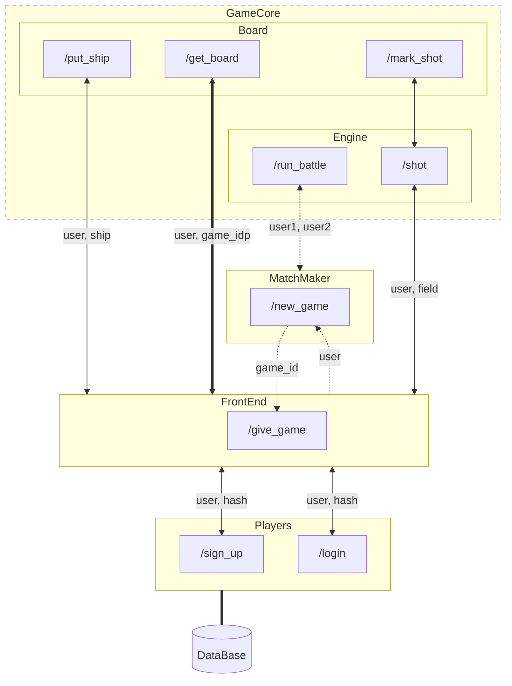

# Battleship

## Architecture
Below we are presenting architecture diagram of the project.
Dotted line denote flow during starting new game from waiting for opponent until received by frontend game id.
* Players
    
    Service responsible for handling user accounts.
    Has access to the data base to store user names and theirs password's hash.

* FrontEnd

    Service share GUI with game.

* MatchMaker

    Service handling games. If any user is starting new game, then the service wait until another player will also be waiting for new game. After this service notify Frontend that new game has started.

* GameCore

    Proxy service intermediary between Frontend and

    * Engine

        responsible for notify about win, loss and any validation error, like forbidden ship place.
    
    * Board

        Share necessary information about current state on the board to visualize it.
